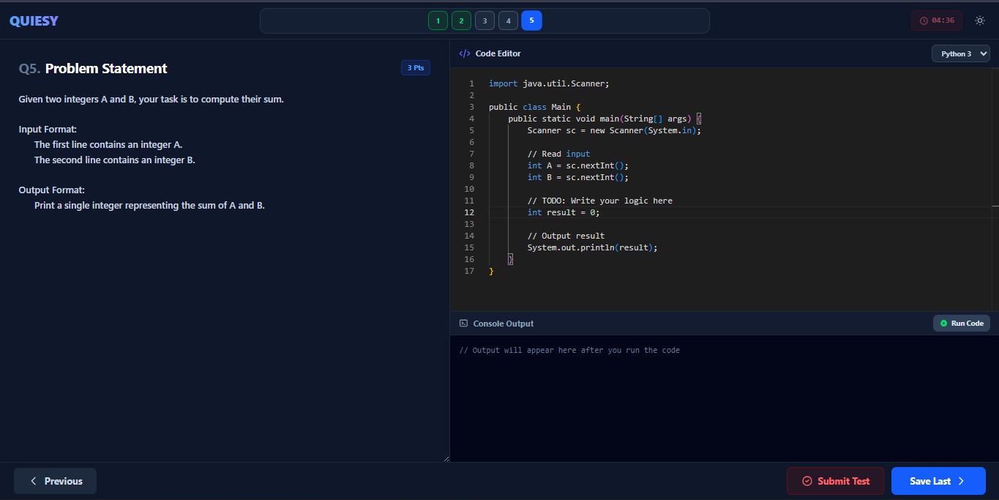
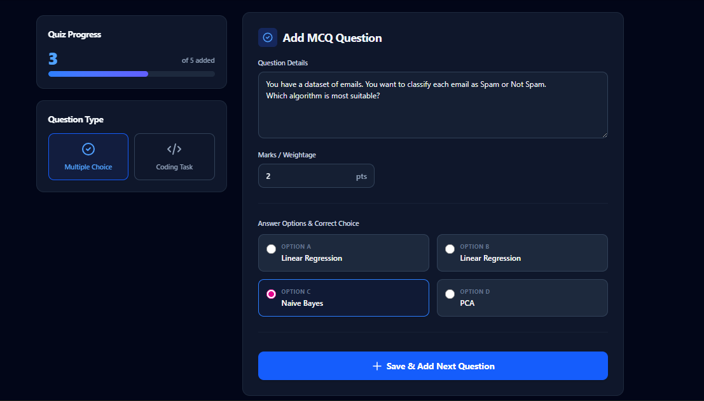
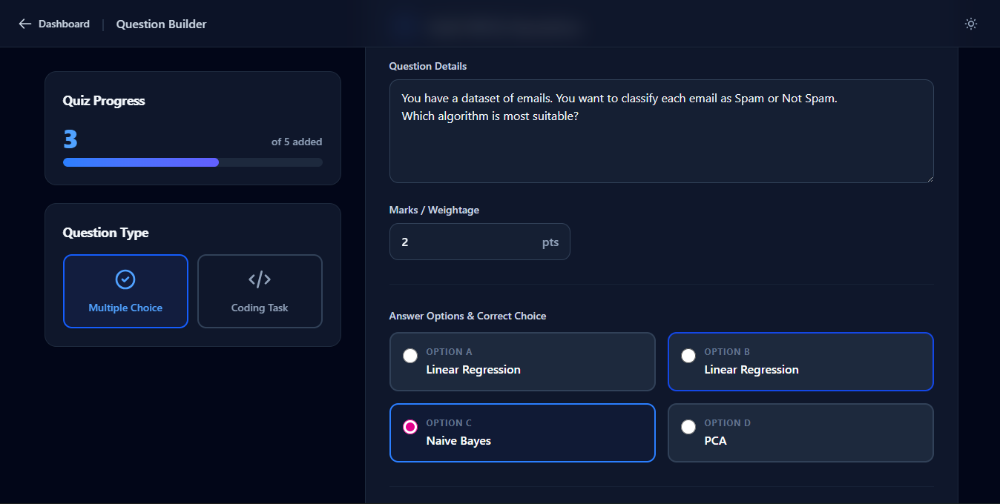
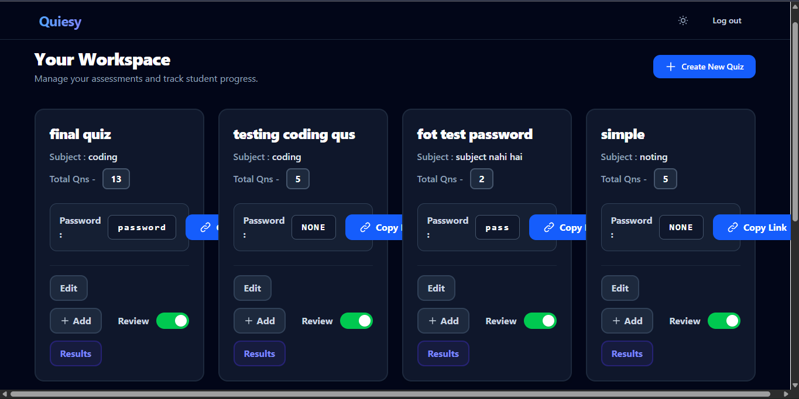
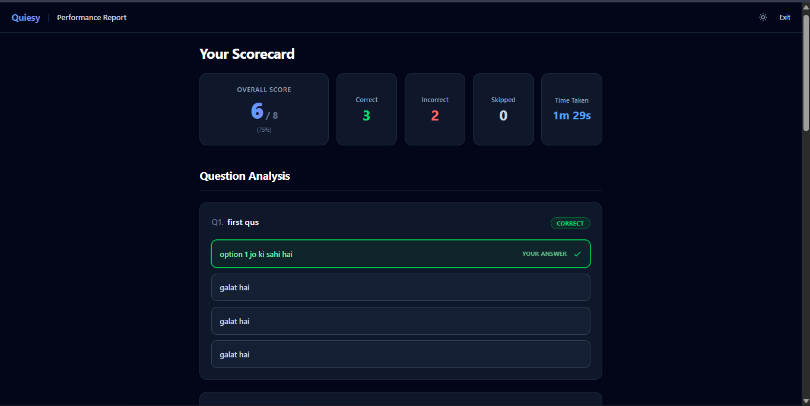

<h1 align="center">Quiesy</h1>

<p align="center">
  <b>Master assessments with next-gen tools.</b><br />
  A modern, dual-mode assessment platform for educators and coding bootcamps.
</p>

<p align="center">
  <a href="#-about-quiesy"></a>
  <a href="#-features"></a>
  <a href="#-technology-stack"></a>
  <a href="#-getting-started"></a>
</p>

<p align="center">
  
  
  
  
</p>

---

## 📖 About Quiesy

**Quiesy** is a full-stack assessment platform designed to make quizzes, coding challenges, and evaluations feel clean, fast, and professional.

It combines:

- a **distraction-free student experience**
- a **powerful teacher dashboard**
- **MCQ and coding assessment modes**
- **analytics, evaluation, and sharing tools**
- a **modern dark/light UI**

Built for educators, trainers, and bootcamps, Quiesy is made to handle both simple tests and advanced technical assessments in one place.

---

## Features

### For Educators

- Create **MCQ quizzes** and **coding challenges**
- Add **hidden test cases** for code evaluation
- Generate and manage quizzes with **secure access codes**
- Copy and share quiz links quickly
- Toggle **student review** visibility
- Track performance with **analytics and score insights**
- Export assessment data for reporting

### For Students

- Clean, focused, and responsive assessment interface
- **Monaco Editor** with syntax highlighting for Python, Java, and C++
- Run code against test cases and view output instantly
- Split-pane layout for better problem solving
- Auto-save and smooth navigation
- Dark/light mode support for comfort

---

## 🖼️ Project Preview

<p align="center">
  
</p>

### Screenshots

<table>
  <tr>
    <td width="50%" align="center">
      
      <br /><sub><b></b></sub>
    </td>
    <td width="50%" align="center">
      
      <br /><sub><b></b></sub>
    </td>
  </tr>
  <tr>
    <td width="50%" align="center">
      
      <br /><sub><b></b></sub>
    </td>
    <td width="50%" align="center">
      
      <br /><sub><b></b></sub>
    </td>
  </tr>
</table>

<p align="center">
  
  <br /><sub><b></b></sub>
</p>

---

## 🛠️ Technology Stack

### Frontend

- **React.js** (Vite)
- **Tailwind CSS**
- **React Router DOM**
- **@monaco-editor/react**
- **Recharts**

### Backend

- **Django**
- **Django REST Framework**
- **JWT Authentication**
- **SQLite** for development
- **PostgreSQL** for production

### Core Capabilities

- Secure quiz flow
- Code execution support for Python, Java, and C++
- Hidden test case evaluation
- Analytics-driven result reporting

---

## Getting Started

### Prerequisites

Make sure you have the following installed:

- **Node.js** v16 or above
- **Python** 3.9 or above
- **Git**

### Clone the repository

```bash
git clone https://github.com/your-username/quiesy.git
cd quiesy
```

